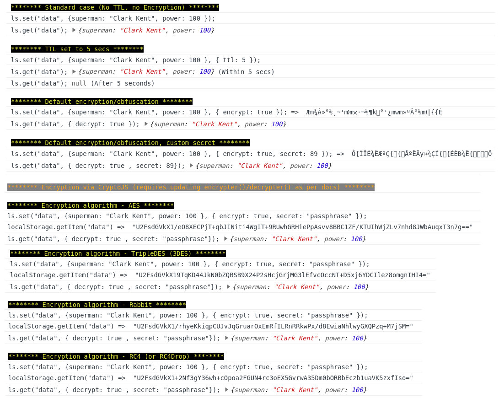

# :zap: localstorage-slim.js :zap:

[](https://www.npmjs.com/package/localstorage-slim)
[](https://app.circleci.com/pipelines/github/digitalfortress-tech/localstorage-slim?branch=master)
[](https://github.com/prettier/prettier)
[](https://www.jsdelivr.com/package/npm/localstorage-slim)
[](https://npm-stat.com/charts.html?package=localstorage-slim)

[](https://opensource.org/licenses/MIT)
[](https://www.paypal.com/donate/?hosted_button_id=PZ5ULVZBZX55A)

---
An ultra slim localstorage wrapper with optional support for **ttl** and **encryption**

**🌟 Highlights 🌟**

- 📦 A localStorage wrapper with **0 DEPENDENCIES** in pure JS (Typescript)!
- 🔥 A super light-weight library [](https://bundlephobia.com/package/localstorage-slim)
- ⏰ Supports **TTL** (i.e. expiry of data in LocalStorage)
- 🧬 Supports **encryption/decryption**
- ⚜️ Store data in **multiple formats** (numbers, strings, objects, arrays, ...) with checks for cyclic references
- 🌐 Works everywhere (falls back to an in-memory store when localStorage is unavailable/blocked due to a security policy, for example: within incognito mode)
- ⚙️ Configurable to use with **sessionStorage** or even a custom store that implements the [Storage interface](https://developer.mozilla.org/en-US/docs/Web/API/Storage).
- 🎀 Framework agnostic!
---

## ➕ Install

```shell script
# you can install typeahead with npm
$ npm install --save localstorage-slim

# Alternatively you can use Yarn
$ yarn add localstorage-slim
```
Then include the library in your App/Page.

**As a module,**
```javascript
// using ES6 modules
import ls from 'localstorage-slim';

// using CommonJS modules
var ls = require('localstorage-slim');
```

**In the browser context,**
```html
<!-- Include the library -->
<script src="./node_modules/localstorage-slim/dist/localstorage-slim.js"></script>

<!-- Alternatively, you can use a CDN with jsdelivr -->
<script src="https://cdn.jsdelivr.net/npm/localstorage-slim"></script>
<!-- or with unpkg.com -->
<script src="https://unpkg.com/localstorage-slim@2.7.0/dist/localstorage-slim.js"></script>
```
The library will be available as a global object at `window.ls`

## 🌱 Usage

Typical usage of localstorage-slim is as follows:

#### Javascript

```javascript
/*** Store in localstorage ***/
const value = {
  a: new Date(),
  b: null,
  c: false,
  d: 'superman',
  e: 1234
}

ls.set('key1', value); // value can be anything (object, array, string, number, ...)
ls.get('key1');  // { a: "currentdate", b: "null", c: false, d: 'superman', e: 1234 }

/* with optional ttl in seconds */
ls.set('key2', value, { ttl: 5 });
ls.get('key2');  // within 5 secs => { a: "currentdate", b: "null", c: false, d: 'superman', e: 1234 }
ls.get('key2');  // after 5 secs => null

/* with optional encryption */
ls.set('key3', value, { encrypt: true }); // "mÆk¬…k§m®À½½°¹¿¯..."
ls.get('key3', { decrypt: true }); // { a: "currentdate", b: "null", c: false, d: 'superman', e: 1234 }
```

---
## <a id="config">🔧 Configuration</a>

`LocalStorage-slim` provides you a config object (**`ls.config`**) which can be modified to suit your needs. The available config parameters are as follows and all of them are completely **OPTIONAL**

| Parameter | Description | Default |
| --------- | ----------- | ------- |
|`ttl?: number\|null` |Allows you to set a global TTL(time to live) **in seconds** which will be used for every item stored in the localStorage. **Global `ttl`** can be overriden with the `ls.set()/ls.get()` API.|`null`|
|`encrypt?: boolean` |Allows you to setup global encryption of the data stored in localStorage [Details](#encryption). It can be overriden with the `ls.set()/ls.get()` API  |`false`|
|`decrypt?: boolean` |Allows you to decrypt encrypted data stored in localStorage. Used **only** by the [`ls.get()`](#lsget) API |`undefined`|
|`encrypter?: (data: unknown, secret: string): string` |The encryption function to be used. A default implementation only obfuscates the value. This function can be overriden with the `ls.set()/ls.get()` API.  |Obfuscation|
|`decrypter?: (encryptedString: string, secret: string): unknown`|A decryption function to be used. A default implementation only performs deobfuscation. This function can be overriden with the `ls.set()/ls.get()` API.  |deobfuscation|
|`secret?: unknown` |Allows you to set a secret key that will be passed to the encrypter/decrypter functions as a parameter. The default implementation accepts a number. **Global `secret`** can be overriden with the `ls.set()/ls.get()` API.  ||
|`storage?: Storage` |Allows you to define the Storage to use: `localStorage`, `sessionStorage` or even a custom store that implements the [Storage interface](https://developer.mozilla.org/en-US/docs/Web/API/Storage). By default, `localStorage` is used and if localStorage is unavailable, then a fallback in-memory store is used |`localStorage`|

---

### <a id="encryption">🧬 Encryption/Decryption</a>

LocalStorage-slim allows you to encrypt the data that will be stored in your localStorage.

```javascript
// enable encryption globally
ls.config.encrypt = true;

// optionally use a different secret key
ls.config.secret = 89;
```
Enabling encryption ensures that the data stored in your localStorage will be unreadable by majority of the users. **Be aware** of the fact that default implementation is not a true encryption but a mere obfuscation to keep the library light in weight. You can customize the `encrypter`/`decrypter` functions to write your own algorithm or to use a secure encryption algorithm like **AES**, **TDES**, **RC4** or **rabbit** via **[CryptoJS](https://www.npmjs.com/package/crypto-js)** to suit your needs.

To use a library like CryptoJS, update the following config options -
```javascript
// enable encryption
ls.config.encrypt = true;
// set a global secret
ls.config.secret = 'secret-password';

// override encrypter function
ls.config.encrypter = (data: unknown, secret: string): string => 'encrypted string';
// override decrypter function
ls.config.decrypter = (encryptedString: string, secret: string): unknown => 'original data';
```

As seen, you can easily override the `encrypter` and `decrypter` functions with your own implementation of encryption/decryption logic to secure your data. Some examples can be found [here](https://digitalfortress.tech/js/encrypt-localstorage-data/).

```javascript
/* After updating the config, use ls as you normally would */
ls.set(...); // internally calls ls.config.encrypter(...);
ls.get(...); // internally calls ls.config.decrypter(...);

/* you can encrypt a particular LS item by providing a different secret as well. */
ls.set("key", "value", { secret: 'xyz'});
ls.get("key", { secret: 'xyz'});
```

**⚠️ Note**: It is recommended that you **do not** save user passwords or credit card details in LocalStorage (whether they be encrypted or not).

---

## ⚙️ Using sessionStorage/custom store

By configuring the `storage` config option, you can easily use another storage instead of the default `localStorage`.

```js
/* use sessionStorage */
ls.config.storage = sessionStorage;

/* OR a custom store/storage via an IIFE */
ls.config.storage = (() => {
  const store = {
    // your storage's implementation...
  };

  return store;
})()
```
**Note**: If you use custom storage, it must implement the [Storage interface](https://developer.mozilla.org/en-US/docs/Web/API/Storage).

---

## ✨ API

The Api is very similar to that of the native `LocalStorage API`.

* [`ls.set()`](#lsset)
* [`ls.get()`](#lsget)
* [`ls.flush()`](#lsflush)
* [`ls.remove()`](#lsremove)
* [`ls.clear()`](#lsclear)

---

#### 🔸 1. <a id="lsset">`ls.set(key, value, config = {})`</a>

Sets an item in the LocalStorage. It can accept 3 arguments

1. `key: string` **[Required]** - The key with which the value should be associated
2. `value: string|Date|Number|Object|Boolean|Null` **[Required]** - The value to be stored
3. `config: Config` **[Optional]** - This argument accepts the same properties as the [global config](#config) object. Defaults to an empty object

Returns `false` if there was an error, else returns `undefined`.

```javascript
const res = ls.set('key', 'value');
console.log('Value =>', res); // returns undefined if successful or false if there was a problem

// with ttl
ls.config.ttl = 3;      // global ttl set to 3 seconds
ls.set('key', 'value'); // value expires after 3s
ls.set('key', 'value', { ttl: 5 }); // value expires after 5s (overrides global ttl)

// with encryption (to encrypt particular fields)
ls.set('key', 'value', { encrypt: true });
```

#### 🔸 2. <a id="lsget">`ls.get(key, config = {})`</a>

Retrieves the Data associated with the key stored in the LocalStorage. It accepts 2 arguments -

1. `key: string` **[Required]** - The key with which the value is associated
2. `config: Config` **[Optional]** - This argument accepts the same properties as the [global config](#config) object. Defaults to an empty object

If the passed key does not exist, it returns `null`.

```javascript
const value = ls.get('key');
console.log('Value =>', value); // value retrieved from LS

// if ttl was set
ls.get('key'); // returns the value if ttl has not expired, else returns null

// when a particular field is encrypted, and it needs decryption
ls.get('key', { decrypt: true });

// get decrypted value when global encryption is enabled
ls.config.encrypt = true;
ls.get('key'); // returns decrypted value
```

#### 🔸 3. <a id="lsflush">`ls.flush(force = false)`</a>

Flushes expired items in the localStorage. This function is called once automatically on initialization. It can accept an **optional** argument `force: boolean` that defaults to `false`. If set to `true`, it force-flushes all items including the ones that haven't expired yet. Note that doing `flush(true)` only affects items that were due to expire sometime in future (i.e. they had a TTL set on them). To remove data, whether or not it has a TTL, use `remove()` or `clear()`.

```javascript
// removes all expired data (i.e. ttl has expired)
ls.flush();
// removes all data that has a ttl (i.e. even if the ttl has not expired yet)
ls.flush(true);
```

#### 🔸 4. <a id="lsremove">`ls.remove(key)`</a>

Accepts the `key: string` as an argument to remove the data associated with it.

```javascript
// delete data from the LS
ls.remove('key'); // returns undefined if successful, false otherwise
```

#### 🔸 5.<a id="lsclear">`ls.clear()`</a>

Clears the entire localstorage linked to the current domain.

```javascript
// removes all data from the LS
ls.clear(); // returns undefined if successful, false otherwise
```
---

### 💠 Screenshot



---

### ❕ Gotchas

When localStorage is not supported by a browser, we fallback to `MemoryStorage`. For websites that don't do full page loads, like SPA's, this is a perfect fallback. But for MPA's, though page crashes get prevented, data is not persisted between page loads.

---
### 🧑‍💻 Contribute

Interested in contributing features and fixes?

[Read more on contributing](./contributing.md).

### 📝 Changelog

See the [Changelog](https://github.com/niketpathak/localstorage-slim/wiki/Changelog)

### 📄 License

[MIT](LICENSE) © [Digital Fortress](https://digitalfortress.tech)
